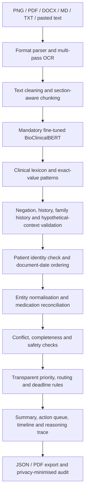

# Clinical Document Intelligence Hub

A Streamlit proof of concept that converts unstructured clinical documents into a structured patient record, readable summary, workflow priority, action queue, medication reconciliation, timeline and evidence trace.

The prototype supports clinical and administrative review. It does not diagnose patients, issue treatment orders or predict clinical outcomes.

## Live Demonstration

Open the deployed prototype:

**[Clinical Document Intelligence Hub](https://gurjar01-clinical-document-intelligence-hub.hf.space)**

The free demonstration server may take one or two minutes to restart after a period of
inactivity. Use only synthetic or properly de-identified documents.

## What It Demonstrates

- Accepts one or more `PNG`, `PDF`, `DOCX`, `MD` or `TXT` files, plus pasted text.
- Uses multi-pass Tesseract OCR for images and local parsers for text documents.
- Extracts patient name, date of birth, age, gender, patient identifier, conditions,
  symptoms, medicines, allergies, adverse reactions, results, dates and follow-up plans.
- Combines fragmented records only after patient-identity checks.
- Separates admission, discharge, stopped, withheld, new and post-discharge medication states.
- Detects record conflicts and clinically relevant changes with source provenance.
- Produces a plain-language summary, dynamic Low/Medium/High workflow priority, routing destination and deadline.
- Shows a draggable evidence-to-action reasoning map.
- Exports the consolidated result as JSON and PDF.

## Quick Start: Analyse A Clinical Document

### 1. Choose an input method

The first screen provides three options:

- **Upload documents** - analyse files from your computer.
- **Paste text** - paste the contents of a clinical note directly.
- **Sample patient records** - run the supplied synthetic patient journeys without
  uploading a file.

### 2. Upload one or more documents

Select **Upload documents**, then add any supported files:

| Format | Typical use |
|---|---|
| `PNG` | Scanned forms, photographed notes or image-based reports |
| `PDF` | Discharge summaries, reports, referrals or laboratory documents |
| `DOCX` | Word-based clinical or administrative records |
| `MD` | Structured Markdown clinical notes |
| `TXT` | Plain-text clinical notes or exported system records |

Documents uploaded together must belong to the same patient. The application checks
the extracted names and rejects a combined record when identities appear incompatible.

For the clearest image result:

- Use a straight, well-lit and readable image.
- Avoid cropped patient details or clinical sections.
- Prefer high contrast and a resolution of at least 1,000 pixels on the longest side.
- Upload the original PDF when available instead of a screenshot of the PDF.

### 3. Create the record

Select **Create patient summary**. The application parses each document separately,
runs clinical extraction, validates context and then consolidates the documents.
BioClinicalBERT can take longer on the first request because the model is loaded into
memory before inference.

### 4. Review before acting

Start with the priority banner, open **Why this priority**, and confirm that the
observed evidence and source document support the proposed workflow. The application
is designed for human review; its output must not be treated as an autonomous clinical
decision.

## How The Answer Is Generated

The system uses a hybrid clinical NLP pipeline:

1. **Document ingestion**
   - Text is read directly from PDF, DOCX, Markdown and TXT documents.
   - PNG images are processed using multi-pass Tesseract OCR.
2. **Clinical entity extraction**
   - The mandatory fine-tuned BioClinicalBERT model identifies semantic entities,
     especially diagnoses and symptoms.
   - A clinical lexicon and validated patterns preserve exact medication doses,
     allergies, laboratory values, identifiers, dates and follow-up instructions.
3. **Context validation**
   - Negated findings such as “no chest pain” are excluded from current symptoms.
   - Historical, hypothetical and family-history statements are separated from current
     patient findings.
   - Implausible or incomplete model spans are rejected.
4. **Record normalisation**
   - Duplicate names for the same condition, symptom, allergy or medicine are merged.
   - Medication state is separated into admission, current, stopped, withheld, new,
     changed and discharge stages.
5. **Multi-document consolidation**
   - Patient identity is checked before documents are combined.
   - Reliable dates are sorted into a longitudinal timeline.
   - Conflicting allergies, medication states and changing diagnoses are surfaced.
6. **Workflow reasoning**
   - Transparent evidence rules calculate operational priority.
   - Each action receives a destination, response window, reason and source document.
7. **Presentation and export**
   - The consolidated record is shown in four review tabs.
   - The result can be downloaded as structured JSON or a readable PDF report.

## Architecture



The extraction layer is hybrid, with fine-tuned BioClinicalBERT required for every app analysis. It is primary for diagnoses and symptoms. Validated patterns preserve complete medication doses, allergies, laboratory values and follow-up instructions when a shorter model span overlaps them. The supporting rules improve precision; they do not replace the model in the live application.

Operational priority and routing are deliberately rule-based and source-grounded. This keeps the decision path reviewable and prevents a generative model from silently issuing clinical decisions.

## Understanding The Output

### Patient and priority header

The header displays the extracted patient name, age, date of birth, patient identifier,
gender and record type. A missing value appears as **Not identified** rather than being
guessed.

The priority banner uses three workflow levels:

| Priority | Meaning |
|---|---|
| **High** | Time-critical evidence or an immediate/same-day workflow was identified |
| **Medium** | Expedited follow-up or coordinated review is recommended |
| **Low** | No escalation rule was identified; routine review or record completion remains |

The operational review index is not a probability that the patient will deteriorate.
It is a transparent workflow score based on the matched evidence rules.

Open **Why this priority** to see:

- **Observed evidence** - the source phrase or result that matched.
- **Interpretation** - why the evidence matters operationally.
- **Contribution** - the transparent rule weight.
- **Response window** - when the review should occur.
- **Source** - the document containing the evidence.

### Patient Summary tab

This tab provides:

- A plain-language consolidated summary.
- The overall recommendation and first action.
- Conditions and assessments.
- Current or discharge medications.
- Symptoms and clinical signs.
- Important laboratory or test results.
- Confirmed allergies and adverse reactions.
- Safety warnings.
- Relevant history, dates and follow-up plans.
- Medication reconciliation.
- Cross-document conflicts or clinically meaningful changes.
- Record completeness and information requiring confirmation.

The summary is generated only from extracted, source-grounded information. A field
showing **Not identified** means that the information was not confidently found; it
does not mean the clinical fact is absent.

### Action Queue tab

The Action Queue converts extracted information into an operational worklist. Each row
contains:

| Column | Interpretation |
|---|---|
| **Priority** | Relative workflow urgency |
| **Action** | The proposed next review or administrative step |
| **Route to** | The team or queue that should receive it |
| **Due** | Suggested response window or extracted follow-up date |
| **Reason** | Evidence-grounded explanation |
| **Source** | Document supporting the action |
| **Status** | Indicates that human confirmation is still required |

Completeness actions such as **Confirm allergy status** are documentation checks, not
treatment instructions.

### Record Timeline tab

The timeline orders documents using dates extracted from their content rather than
upload order. Each event shows:

- Source document and document type.
- Encounter or document date.
- Conditions and key findings recorded at that point.
- The next workflow action associated with that document.

This view is useful for understanding changes across intake forms, emergency notes,
discharge summaries, laboratory reports and later follow-up notes.

### Reasoning Trace tab

The reasoning trace is an interactive evidence-to-action explanation. A user can select
a detected concern and move the graph nodes while reviewing:

1. **Source document**
2. **Observed evidence**
3. **Rule-supported interpretation**
4. **Potential concern or workflow implication**
5. **Proposed intervention or administrative action**

The graph was inspired by causal-reasoning principles that distinguish observations,
assumptions and interventions. In this POC, however, it is an explanation of the
matched workflow rule. It does not prove medical causation and does not forecast a
patient’s future outcome.

### Information To Confirm

The checklist identifies information that is absent, unclear or contradictory. Checking
an item records that it has been reviewed in the current session. It does not change the
source document, assert that the information was found or mark the clinical issue as
resolved.

### Extraction confidence

The expandable confidence view includes the extracted value, confidence level, source
text and extraction method:

- **High** - explicitly documented or captured by a validated exact-value pattern.
- **Medium** - contextually extracted but should be checked against the source.
- **Low** - uncertain and requires careful confirmation.

Confidence describes extraction certainty for that field, not the correctness of the
entire document analysis.

### Downloads

- **Download JSON** provides machine-readable structured data suitable for API,
  workflow or analytics integration.
- **Download PDF** provides a human-readable review report containing the summary,
  extracted fields, medication reconciliation, action queue and timeline.

## Run Locally

Python 3.11 or newer is recommended.

```bash
python -m venv .venv
source .venv/bin/activate
pip install -r requirements.txt
./scripts/download_model.sh
```

Image input also requires Tesseract:

```bash
# macOS
brew install tesseract

# Ubuntu/Debian
sudo apt-get install tesseract-ocr
```

Start the app:

```bash
streamlit run app.py
```

Open [http://localhost:8501](http://localhost:8501).

The app requires the fine-tuned checkpoint at `models/bioclinicalbert-ner`. GitHub
does not store the 411 MB model binary because it exceeds the normal file limit. The
download script retrieves the exact deployed checkpoint from the public Hugging Face
Space. If the checkpoint is missing or cannot load, analysis stops with a clear
configuration error instead of silently using a different extractor.

## Public Deployment

The recommended public host is a Hugging Face Docker Space because the application
needs both the 411 MB BioClinicalBERT checkpoint and the Tesseract system package.

1. Create a free Hugging Face account.
2. Create a write token at `https://huggingface.co/settings/tokens`.
3. Authenticate locally:

   ```bash
   hf auth login
   ```

4. Publish the application, replacing the example with your account and Space name:

   ```bash
   ./scripts/deploy_huggingface.sh YOUR_USERNAME/clinical-document-intelligence-hub
   ```

The command creates a public CPU Docker Space, uploads a privacy-scoped deployment
bundle including the checkpoint, and prints:

```text
https://YOUR_USERNAME-clinical-document-intelligence-hub.hf.space
```

Free Spaces sleep after inactivity, so the first request after a quiet period can take
time while the container and model start. Do not upload identifiable patient documents
to a public demonstration service. Use synthetic or properly de-identified records.

To reproduce fine-tuning from the included synthetic data:

```bash
python scripts/train_bioclinicalbert_ner.py \
  --epochs 6 \
  --batch-size 8 \
  --unfreeze-layers 2
```

The checkpoint is excluded from Git because the model file is approximately 411 MB. The recorded test result is precision `82.69%`, recall `97.50%` and F1 `89.48%` on the synthetic held-out split. These are POC extraction metrics, not clinical validation results.

## Data And Examples

The project contains 144 synthetic clinical notes and 1,476 entity annotations:

- `data/clinical_poc_synthetic_dataset.csv`
- `data/clinical_poc_entity_annotations.csv`

No real patient data is required. The sample UI uses the same inference path as uploaded files; gold labels are not injected into the live demonstration.

Repository-owned examples are in:

- `examples/inputs/`: PDF, TXT, Markdown and PNG test documents.
- `examples/outputs/`: consolidated JSON and PDF output for the three-document case.
- `examples/cross_format/`: one equivalent synthetic note in PNG, PDF, DOCX, Markdown and TXT, its expected fields and the model verification report.

Regenerate and verify the cross-format example:

```bash
python scripts/generate_cross_format_example.py
python scripts/verify_model_checkpoint.py
python scripts/verify_cross_format_bioclinicalbert.py
```

The cross-format verification requires every format to preserve identity, date, diagnoses, positive symptoms, negation, medicines, allergy, laboratory values and workflow priority. It also requires genuine `BioClinicalBERT`-sourced entities for every file.

## Test

```bash
python -m unittest discover -s tests -v
```

The automated suite currently contains 67 passing regression tests covering input
parsing, OCR, table-style and line-oriented demographics, negation, historical and
family-history context, identity conflicts, long and short notes, medication states,
deduplication, dynamic priority, timelines, exports, auditing and real multi-document
examples. The separate cross-format verifier loads the mandatory checkpoint and
exercises all five upload formats.

## Project Layout

```text
app.py                         Streamlit interface
src/                           extraction, consolidation, rules, exports and audit
data/                          synthetic document and entity datasets
examples/inputs/               realistic demo documents
examples/outputs/              example JSON and PDF result
scripts/                       dataset generation, training and break-glass audit tools
tests/                         automated regression suite
docs/                          architecture and requirement traceability
MODEL_EVALUATION.md            model training result and limitations
models/bioclinicalbert-ner/    checkpoint metadata and local model artifact
```

## Safety And Production Boundaries

- Do not upload identifiable patient data to the public demonstration server.
- The priority score is a workflow indicator, not NEWS2, qSOFA or a probability of deterioration.
- The reasoning map explains matched evidence and expert rules; it does not establish medical causation.
- The model test F1 is measured on synthetic POC data and must not be interpreted as
  clinical accuracy on all real-world documents.
- Raw document text is not stored in the default audit log. Optional encrypted break-glass storage requires `BREAK_GLASS_AUDIT_KEY`.
- Production use would require approved de-identified data, external clinical validation, security and bias assessment, governance approval and integration testing.

See [docs/REQUIREMENTS_TRACEABILITY.md](docs/REQUIREMENTS_TRACEABILITY.md) for the brief-to-implementation checklist.
