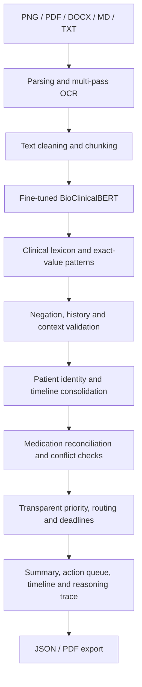

**title: Clinical Document Intelligence Hub**

***Developed by Priyanshu Gurjar***

# Clinical Document Intelligence Hub

An AI prototype that converts unstructured clinical documents into one structured,
decision-ready patient record. It reduces manual review effort while keeping every
recommendation traceable to source evidence.

**Live demo:**
[gurjar01-clinical-document-intelligence-hub.hf.space](https://gurjar01-clinical-document-intelligence-hub.hf.space)

> Use synthetic or de-identified documents only. This POC supports human review and
> does not diagnose patients or replace clinical judgement.

## Core Capabilities

- Accepts `PNG`, `PDF`, `DOCX`, `MD`, `TXT` and pasted text.
- Extracts patient identity, diagnoses, symptoms, medicines, allergies, test results,
  dates and follow-up plans.
- Combines multiple documents into a chronological patient record.
- Reconciles medication states and detects cross-document conflicts.
- Generates a plain-language summary, workflow priority, routing and deadlines.
- Provides an evidence-to-action reasoning trace.
- Exports the result as JSON and PDF.

## How To Operate

1. Open the live demo and choose **Upload documents**, **Paste text** or
   **Sample patient records**.
2. Add one or more documents belonging to the same patient and select
   **Create patient summary**.
3. Review the priority evidence, extracted facts, action queue and source documents
   before downloading the JSON or PDF report.

For image input, use a clear, straight and well-lit scan. Upload the original PDF
instead of a screenshot when possible.

## System Workflow



## How The Model Works

1. **Ingestion:** local parsers read text documents; Tesseract OCR reads images.
2. **AI extraction:** a fine-tuned BioClinicalBERT model identifies clinical diagnoses
   and symptoms.
3. **Precision layer:** validated patterns preserve complete medication doses,
   allergies, laboratory values, dates and patient identifiers.
4. **Context checks:** negated, historical, hypothetical and family-history findings
   are separated from current patient findings.
5. **Consolidation:** duplicate entities are normalised and documents are joined only
   after patient identity checks.
6. **Reasoning:** visible evidence rules generate workflow priority, route, deadline
   and recommended review action.

BioClinicalBERT is mandatory in the live application. If its checkpoint is unavailable,
analysis stops instead of silently switching to a rule-only extractor.

## Understanding The Output

### Patient Summary

Shows extracted demographics, clinical findings, medication reconciliation,
cross-document conflicts, missing information and an overall recommendation.
**Not identified** means the information was not confidently found, not that it is
clinically absent.

### Action Queue

Lists each proposed action with its priority, receiving team, deadline, reason,
supporting document and human-review status.

### Record Timeline

Orders documents by dates found in their content and shows how conditions, results and
actions change across the patient record.

### Reasoning Trace

Displays the path from source document to observed evidence, rule-supported
interpretation and proposed action. It explains the workflow logic; it does not prove
medical causation or predict a patient outcome.

### Priority Levels

| Level | Interpretation |
|---|---|
| **High** | Immediate or same-day review evidence was identified |
| **Medium** | Expedited follow-up or coordinated review is required |
| **Low** | Routine review or documentation completion is appropriate |

The operational review index is a transparent workflow score, not a probability of
clinical deterioration.

## Architecture

| Layer | Technology and responsibility |
|---|---|
| Interface | Streamlit upload, review and download workflow |
| Parsing | PyPDF, DOCX/XML parsing, Markdown cleaning and Tesseract OCR |
| AI model | Fine-tuned `emilyalsentzer/Bio_ClinicalBERT` clinical NER |
| Validation | Negation, temporality, entity confidence and exact-value patterns |
| Intelligence | Consolidation, medication states, conflicts and completeness |
| Explainability | Source-grounded rules and interactive reasoning graph |
| Outputs | Patient summary, action queue, timeline, JSON, PDF and audit reference |

## Model Evaluation

| Metric | Synthetic held-out test result |
|---|---:|
| Precision | 82.69% |
| Recall | 97.50% |
| F1 score | 89.48% |

The repository includes 144 synthetic notes, 1,476 entity annotations and 67 automated
tests. PNG, PDF, DOCX, Markdown and TXT formats are tested through the mandatory model.
These are POC results, not clinical validation metrics.

## Run Locally

```bash
git clone https://github.com/priyanshugurjar9/Firstsource-Clinical.git
cd Firstsource-Clinical

python -m venv .venv
source .venv/bin/activate
pip install -r requirements.txt
./scripts/download_model.sh

# Required for image OCR on macOS
brew install tesseract

streamlit run app.py
```

Open `http://localhost:8501`.

## Project Structure

```text
app.py                    Streamlit interface
src/                      Extraction, reasoning, consolidation and export logic
models/                   BioClinicalBERT configuration and evaluation metadata
data/                     Synthetic training and annotation datasets
examples/                 Cross-format sample inputs and outputs
tests/                    Automated regression tests
docs/                     Architecture and requirement traceability
scripts/                  Training, verification, model download and deployment
```

## Limitations

- Public deployment must not process identifiable patient information.
- The model requires external validation on approved, de-identified real-world data.
- Workflow recommendations require qualified human confirmation.
- Production use requires clinical governance, security, bias and integration testing.
