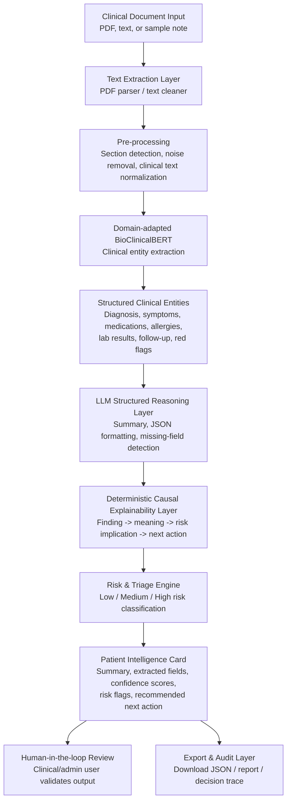

```mermaid
flowchart TD
    A["Clinical Document Input<br/>PDF, text, or sample note"] --> B["Text Extraction Layer<br/>PDF parser / text cleaner"]

    B --> C["Pre-processing<br/>Section detection, noise removal, clinical text normalization"]

    C --> D["Domain-adapted BioClinicalBERT<br/>Clinical entity extraction"]

    D --> E["Structured Clinical Entities<br/>Diagnosis, symptoms, medications, allergies,<br/>lab results, follow-up, red flags"]

    E --> F["LLM Structured Reasoning Layer<br/>Summary, JSON formatting, missing-field detection"]

    F --> G["Deterministic Causal Explainability Layer<br/>Finding -> meaning -> risk implication -> next action"]

    G --> H["Risk & Triage Engine<br/>Low / Medium / High risk classification"]

    H --> I["Patient Intelligence Card<br/>Summary, extracted fields, confidence scores,<br/>risk flags, recommended next action"]

    I --> J["Human-in-the-loop Review<br/>Clinical/admin user validates output"]

    I --> K["Export & Audit Layer<br/>Download JSON / report / decision trace"]
```
