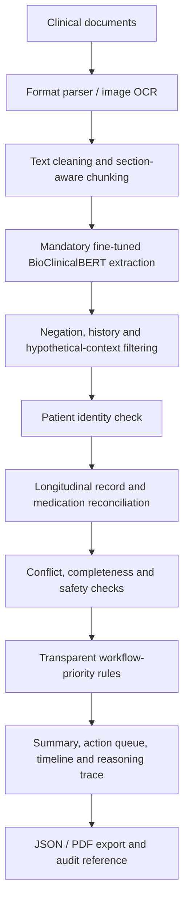

# Architecture And Design Decisions

## Processing Flow



## Why A Hybrid Extractor

BioClinicalBERT is the mandatory first extraction stage and is primary for semantic entities such as diagnoses and symptoms. Validated clinical patterns take precedence only for exact-value fields such as medication doses, allergies, laboratory results and follow-up instructions, where preserving the complete source span is essential. Contextual validation removes negated, historical, hypothetical and implausible spans.

The application stops with a configuration error if the checkpoint is unavailable. There is no silent rule-only fallback in the live workflow.

## Why Rules Own Priority

The extraction model identifies information; it does not decide urgency. Priority, routing and deadlines come from visible rules with named evidence sources. This separation makes false positives easier to inspect and allows clinical rules to be reviewed independently from model training.

## Cross-Format Verification

One synthetic note is generated as PNG, PDF, DOCX, Markdown and TXT. The mandatory checkpoint is run against all five parsed documents. The acceptance test checks identity, date, diagnoses, positive and negated symptoms, medicines, allergy, laboratory values and priority.

Run:

```bash
python scripts/generate_cross_format_example.py
python scripts/verify_cross_format_bioclinicalbert.py
```

The machine-readable result is stored at `examples/cross_format/verification_report.json`.

## Multi-Document Design

Each document is analysed separately before consolidation. The pipeline:

1. Rejects incompatible patient identities.
2. Preserves source-document provenance.
3. Sorts reliable dates chronologically.
4. Normalises duplicate entities and medication names.
5. Tracks medication state changes by stage.
6. Separates contradictions from genuine clinical changes.
7. Creates one combined action queue and recommendation.

## Explainability Boundary

The evidence map was inspired by Judea Pearl's distinction between observation, assumption and intervention. In this POC it is an explanation of expert-rule logic, not causal discovery and not a patient-outcome forecast.
